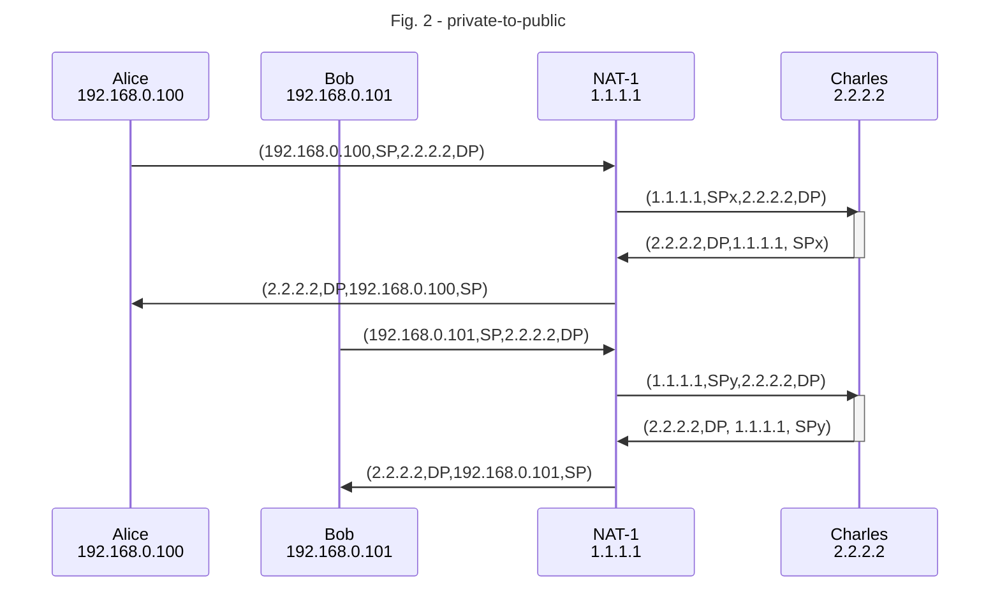
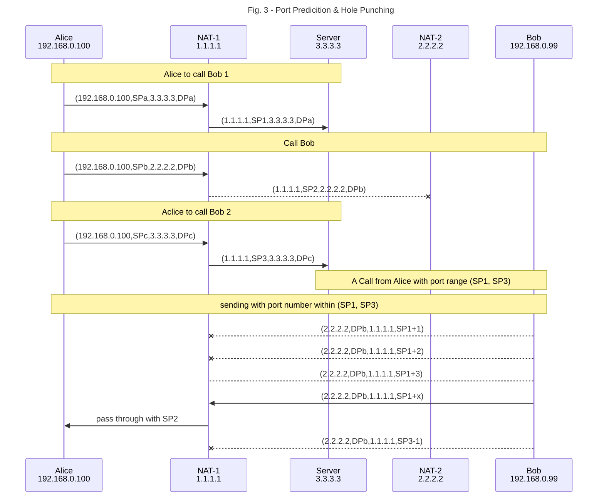

import ExtLink from "@/components/ExtLink"
import { Mermaid } from 'mdx-mermaid/lib/Mermaid';

I initiated a VoIP company in 2000. It operated successfully until the introduction of free Skype. Our modest start-up was entirely impacted. Yet, the P2P NAT traversal technique we employed was quite innovative in the early 2000s. I will endeavor to briefly describe UDP/IP packet exchanges for devices located behind their configured NATs.

### What is NAT?

NAT (Network Address Translation) is needed for sending/receiving packets to/from outside. An IP packet has four tuples (Source Address, Source Port, Destination Address, Destination Port) for identifying the address and application for the packet. It's better to see a sequence diagram as depicted in the figure below

<Mermaid chart={`
sequenceDiagram
    title Fig. 1 - Port Forwarding
    participant A as Alice   192.168.0.100
    participant B as NAT-1   1.1.1.1
    participant C as NAT-2   2.2.2.2
    participant D as Bob   192.168.0.99
    A-->D: Hello!
    A->>B: (192.168.0.100,SP,2.2.2.2,DP)
    B->>C: (1.1.1.1,SPx,2.2.2.2,DP)
    Note right of C: Port Forwarding
    C->>D: (1.1.1.1,SPx,192.168.0.99,DP)
`} />

As can be seen in the [Figure 1](#figure1), Alice has a private local IP address, 192.168.0.100; NAT-1 changes two tuples (Source Address, Source Port) of the packet before sending out, the packet reaches NAT-2, and NAT-2 can check (Destination Port) to see if is is a well-know port number and forwards the packet to its pre-assigned destination. This scenario is called [<ExtLink>port forwarding</ExtLink>](https://en.wikipedia.org/wiki/Port_forwarding).

Let's see another scenario, two clients sending different packets to the same server with a public IP address.

As can be seen in the [Figure 2](#figure2), NAT assigns two different Source Port, SPx and SPy for each packets. The reason is simple, NAT needs to send replied packets back to the source. NAT needs to keep track of the session, translated source port is the key.

### NAT Traversal

The method I used in my P2P VoIP network can be explained by this lengthy article [<ExtLink>NAT Traversal Techniques</ExtLink>](https://github.com/P2PSP/core/blob/master/doc/NTS/NAT_traversal.md). I try to use a simplified figure to depict it.

The key is to have a server with a public IP address to help Alice and Bob who are sitting behind NATs with strict port checking rules. Alice sends three packets out to 'punch a hole'. Its sending order is important; first to server, second to Bob and third to server. So Server collects two packets with assigned source port number. This info is forwarded to Bob. Bob can use it to predict second packet's source port number by sending number of packets to Alice. Most of the time, it works. 

As seen in the [Figure 3](#figure3), Bob predicts SP2 by sending out many packets within the reang of (SP1, SP3).

