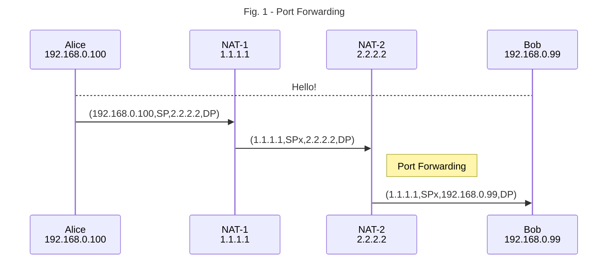

import ExtLink from "@/components/ExtLink"

I started a VoIP business in year 2000. It went find until a free Skype came out. Our small start-up was affected completely. However, the technique of P2P NAT traverse we used was quite new in the early 2000. I will try to explain a little about UDP/IP packets transactions for entities sitting behind their installed NATs.

### What is NAT?

NAT (Network Address Translation) is needed for sending/receiving packets to/from outside. An IP packet has four tuples (Source Address, Source Port, Destination Address, Destination Port) for identifying the address and application for the packet. It's better to see a sequence diagram as depicted in the Figure 1 below.

As can be seen in the Figure 1, Alice has a private local IP address, 192.168.0.100; NAT-1 changes two tuples (Source Address, Source Port) of the packet before sending out, the packet reaches NAT-2, and NAT-2 can check (Destination Port) to see if is is a well-know port number and forwards the packet to its pre-assigned destination. This scenario is called [<ExtLink text="port forwarding" />](https://en.wikipedia.org/wiki/Port_forwarding).

Let's see another scenario, two clients sending different packets to the same server with a public IP address.

As can be seen in the Figure 2, NAT assigns two different Source Port, SPx and SPy for each packets. The reason is simple, NAT needs to send replied packets back to the source. NAT needs to keep track of the session, translated source port is the key.

### NAT Traversal

The method I used in my P2P VoIP network can be explained by this lengthy article [<ExtLink text="NAT Traversal Techniques" />](https://github.com/P2PSP/core/blob/master/doc/NTS/NAT_traversal.md). I try to use a simplified figure to depict it.

