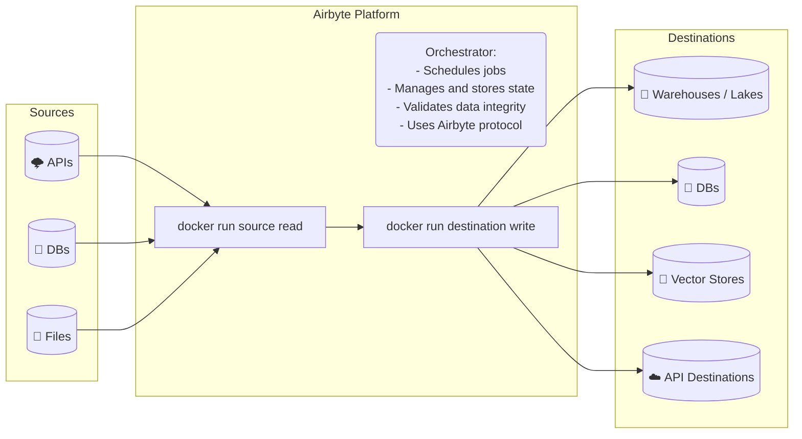

I started a VoIP business in year 2000. It went find until a free Skype came out. Our small start-up was defeated comletely. However, the technical I used is pretty advanced in the early 2000.

```mermaid

flowchart LR
     subgraph Sources
         api[("🌩️  APIs")]
         db[("💽 DBs")]
         files[("📂 Files")]
     end
 
     subgraph "Airbyte Platform"
         note("Orchestrator:<br/>- Schedules jobs<br/>- Manages and stores state<br/>- Validates data integrity<br/>- Uses Airbyte protocol")
         src["docker run source read"]
         dst["docker run destination write"]
 
         src --> dst
     end
 
     subgraph Destinations
         warehouse[("🏢 Warehouses / Lakes")]
         lake[("💽 DBs")]
         vectors[("🧮 Vector Stores")]
         destapi[("☁️ API Destinations")]
     end
 
     api --> src
     db --> src
     files --> src
     dst --> warehouse
     dst --> lake
     dst --> vectors
     dst --> destapi

```
